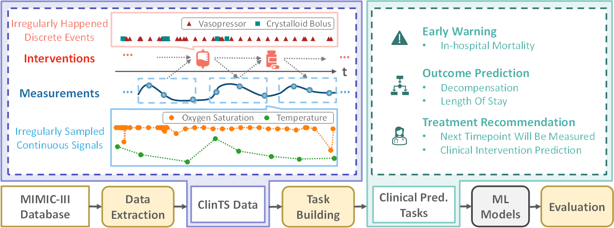

# ClinTS-HII: A Clinical Time-series Benchmark Targeting Heterogeneity, Irregularity, and Interdependency



## About

   To support the comprehensive modeling of the *heterogeneity*, *irregularity*, and *interdependency* characteristics of ClinTS, we build a new benchmark, named **ClinTS-HII**.
   This repository maintains all the documentation and needed scripts to build the ClinTS-HII benchmark.
   We selected 12 common biomarker variables to indicate the physiological states of a patient and 11 widely used interventions in intensive care units to represent the major events interdependent on these physiological states. 

   This benchmark includes a diverse set of clinical tasks covering different clinical scenarios for evaluation. The following table summarizes the statistics of these tasks.

   |  Task (Abbr.)   | Type  | # Train | # Val. | # Test | Clinical Scenario |
   |  :----  | :----: | ----: | ----: | ----: | :---- |
   | In-hospital Mortality (MOR) | BC | 34, 054 | 8, 541 | 10, 643 | Early warning |
   | Decompensation (DEC)        | BC | 87, 006 | 21, 752 | 27, 190 | Outcome pred. |
   | Length Of Stay (LOS)        | MC | 299, 706 | 74, 927 | 93, 659 | Outcome pred. |
   | Next Timepoint Will Be Measured (WBM) | ML | 274, 278 | 68, 570 | 85, 712 | Treatment recom. |
   | Clinical Intervention Prediction (CIP) | MC | 175, 557 | 43, 890 | 54, 862 | Treatment recom. |

   This repository has been divided into the following folders:

   - **preprocess**: 
      - ```data-extraction.py```: data extraction script.
      - ```data-preprocessing.ipynb```: task building script.
   - **baselines**: containing executable codes of baseline models.
   - **data**: containing the data extracted from MIMIC-III.
   - **evaluation**: containing evaluation scripts. (under construction :construction:)

## Setup

   ### Requirements

   Your local system should have the following executables:

   - [conda](https://docs.conda.io/projects/conda/en/latest/user-guide/install/index.html)
   - [PostreSQL](http://www.postgresql.org/download/)
   - Python 3.7 or later
   - git

   ### Create conda environment

   All instructions below should be executed from a terminal.

   1. clone this repository and run 
   ```bash
   cd ClinTS_HII
   ```
   2. create an environment ```clints-hii``` and activate it.
   ```bash
   conda create -n clints-hii python=3.7
   conda activate clints-hii
   ```
   3. install the required Python modules using file [requirements.txt](requirements.txt).
   ```bash
   pip install -r requirement.txt
   ```
   Tips: If you cannot install psycopg2 successfully, please try ```sudo apt-get install libpq-dev``` first and then run the command ```pip install psycopg2```.

## Download Data & Task Building

   ### I. Access to MIMIC-III data

   1. First you need to have an access to MIMIC-III Dataset, which can be requested [here](https://mimic.physionet.org/gettingstarted/access/). The database version we used here is v1.4.
   2. Download the MIMIC-III Clinical Database and place the MIMIC-III Clinical Database as either .csv or .csv.gz files somewhere on your local computer.

   ### II. Create MIMIC-III in a local Postgres database

   Follow the [scripts](https://github.com/MIT-LCP/mimic-code/tree/main/mimic-iii/buildmimic/postgres) to create a database to host the MIMIC-III data.  


   ### III. Generate datasets

   1. Once the database has been created, make sure the database server is running. Then, run the file [data_extraction.py](./preprocess/data_extraction.py) with your PostgreSQL database parameters to extract vital signal and intervention features from MIMIC-III (See [here](https://github.com/MIT-LCP/mimic-code/tree/main/mimic-iii/buildmimic/postgres) for more details).
      ```bash
      python ./preprocess/data-extraction.py --dbname [dbname] --user [user_name] \
                                             --host [host] --password [password] \
                                             --search_path [search_path]
      ```
   2. To build CIP task, please obtain file ```all_hourly_data.h5``` from [MIMIC_Extract](https://github.com/MLforHealth/MIMIC_Extract) first, and place it in the ```./data/``` folder.
   3. As step 1, run file [data-preprocessing.py](./preprocess/data-preprocessing.py) to build tasks:
      ```bash
      python ./preprocess/data-preprocessing.py --dbname [dbname] --user [user_name] \
                                                --host [host] --password [password] \
                                                --search_path [search_path]
      ```

   You can also read [data-preprocessing.ipynb](preprocess/data-preprocessing.ipynb) for more data processing and task statistics details.

   ### IV. Data splitting
   For each task, we randomly split 20% of the collected data into the testing set, 20% of the remaining part into the validation set, and left the rest for the training set.
   After building the tasks, please run the following command for data splitting.
   ```bash
   python ./preprocess/data_split.py --path path/to/task_data_folder/
   ```

## Baselines

   ### Custom training

   To run the GRU-HII baseline proposes in this paper, using the 

   ```bash
   python baselines/GRU-HII/GRU-HII.py --task in_hospital_mortality \
                                       --niters 200 --alpha 5 \
                                       --lr 0.0001 --batch-size 32 \
                                       --rec-hidden 128 --num-heads 4 \
                                       --sample-times 5 --least-winsize 0.5 \
                                       --causal-masking --seed 0
   ```


   - ```task```: the downstram task name, select from ```[in_hospital_mortality, decom, cip, wbm, los]```
   - ```cip```: assigning the sub-tsak of CIP task if set ```--task cip```, select from ```[vent, vaso]```
   - ```alpha```: the loss weight of downstream task
   - ```rec-hidden```: the dimension of hidden states
   - ```sample-times```: the number of sample times each batch to calculate log-likelihoods
   - ```num-heads```: the number of attention head \
   - ```least-winsize```: 
   - ```causal-masking```: using causal mask to distinguish interventions and measurements or not.
   - ```seed```: the seed for parameter initialization.
   


   ### Reproduce experiments from the paper

   If you are interested in reproducing the experiments from the paper, you can directly use the scripts in ```./baselines/```. 

   - [AdaCare](https://github.com/Accountable-Machine-Intelligence/AdaCare)
   - [HiTANet](https://github.com/HiTANet2020/HiTANet)
   - [MUFASA](https://github.com/Google-Health/records-research/tree/master/multimodal-architecture-search)
   - [SDPRL](https://epubs.siam.org/doi/abs/10.1137/1.9781611976700.66)
   - [GRU-D](https://www.nature.com/articles/s41598-018-24271-9)
      ```bash
      python ./baselines/GRU-D.py --task [task_name] --seed [seed_num]
      ```
   - [Phased-LSTM](https://proceedings.neurips.cc/paper/2016/hash/5bce843dd76db8c939d5323dd3e54ec9-Abstract.html)
      ```bash
      python ./baselines/Phased-LSTM.py --task [task_name] --seed [seed_num]
      ```
   - [Latent-ODEs](https://github.com/YuliaRubanova/latent_ode)
      ```bash
      python ./baselines/latent-ode.py --task [task_name] --random-seed [seed_num]
      ```
   - [IP-Nets](https://github.com/mlds-lab/interp-net)
      ```bash
      python ./baselines/IP-Nets.py --task [task_name] --seed [seed_num]
      ```
   - [mTAN](https://github.com/reml-lab/mTAN)
   - **GRU-HII**: 
      ```bash
      bash ./baselines/GRU-HII/run_gruhii.sh
      ```

## Evaluation

Under construction :construction:

## License

The original [MIMIC-III database](https://mimic.mit.edu/docs/iii/) is hosted and maintained on [PhysioNet](https://physionet.org/about/) under [PhysioNet Credentialed Health Data License 1.5.0](https://physionet.org/content/mimiciii/view-license/1.4/), and is publicly accessible at [https://physionet.org/content/mimiciii/1.4/](https://physionet.org/content/mimiciii/1.4/).

Our code in this repository is licensed under the [MIT license](https://github.com/nullnullll/ClinTS_HII/blob/main/LICENSE) at present and will move them into an official repository then.